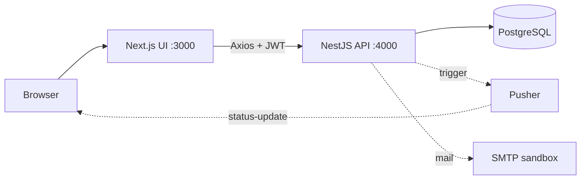
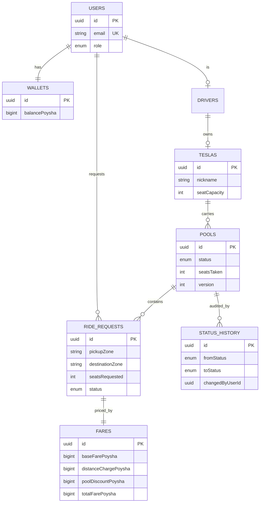

# 🛺 Dhaka Tesla Pool

> Share a seat. Split the fare. Survive Dhaka traffic.

A ride-pooling MVP for three-seat "Tesla" three-wheelers. Passengers (**Nusrat, Rafiq, Shirin**) request rides; **Jashim** drives **Bullet** (3 seats); compatible requests share a Tesla, each with an individual fare, and seat capacity can never be exceeded, even under concurrent claims.

- **Demo video:** _add link here_ · **Deployment:** _add link here (or see Docker instructions)_
- **Screenshots:** _add to `docs/` after first run_

## Stack & justification

| Layer | Choice | Alternatives | Why it fits | Switch when |
|---|---|---|---|---|
| Frontend | Next.js 14 App Router, Tailwind + DaisyUI, Axios | Plain React + Vite | Folder routing, `loading/error/not-found` segments; DaisyUI gives a consistent UI fast | Need heavy SSR/SEO → use more Server Components |
| Backend | NestJS | Express, Fastify | Modules/DI/guards/pipes map directly onto auth, validation and layered services | Extreme throughput → Fastify adapter |
| DB | PostgreSQL | MySQL, SQLite | Row-level locks (`SELECT … FOR UPDATE`), enums, FKs: exactly what seat capacity needs | Geo-matching at scale → PostGIS |
| ORM | TypeORM | Prisma, Drizzle | Mandated; first-class NestJS integration, pessimistic locking, migrations | Prefer schema-first types → Prisma |
| Auth | JWT (Bearer) + Guards, bcrypt | Sessions, httpOnly cookie | Stateless API, easy role guards | Production → httpOnly cookie + refresh tokens |
| Realtime | Pusher (optional) + 5s polling fallback | Socket.IO | Free tier, no infra; app works without keys | Cost/volume → self-hosted WebSockets |
| Mail | Nodemailer (Ethereal/Mailtrap sandbox) | SES | Free, optional | Real delivery → SES/Resend |
| Tests | Jest | Vitest | Nest default | — |

## Architecture



## ERD



Table notes: `pools` = one physical trip on a Tesla (owns lifecycle + `seatsTaken`); `ride_requests` = one passenger's seat(s) in a pool with its own status; `fares` = per-passenger price; `status_history` = append-only audit trail; `wallets` = simulated TeslaPay (integer poysha). Indexes on `status`, `teslaId`, `passengerId`, `pickupZone`.

## Lifecycle

`REQUESTED → MATCHED → DRIVER_ARRIVED → STARTED → COMPLETED`, with `CANCELLED` allowed only before `STARTED`. Enforced server-side by `ALLOWED_TRANSITIONS`; illegal jumps return **422**. Driver actions apply to the pool and cascade to non-cancelled requests; a passenger cancels only their own request, which releases their seats.

## Matching rule

Two requests can pool when they have the **same pickup zone** and their **destinations share a corridor** (`zones.data.ts`). Nusrat (Banani→Mohakhali) and Rafiq (Banani→Gulshan 1) both start in Banani and end in the `gulshan-banani-mohakhali` corridor, so they pool.

## Fare model (hand-testable)

`passengerFare = baseFare + distanceCharge − poolDiscount`

- baseFare = ৳30.00 (3000 poysha); distanceCharge = ৳15.00/km × haversine km (rounded to poysha); poolDiscount = 20% of distanceCharge when the Tesla is shared.
- **Nusrat** (Banani→Mohakhali, 1.835 km): 3000 + 2752 − 550 = **5202 poysha (৳52.02)**
- **Rafiq** (Banani→Gulshan 1, 1.639 km): 3000 + 2459 − 492 = **4967 poysha (৳49.67)**
- Solo, Nusrat would pay 5752. When Rafiq joins, Nusrat's fare is recalculated as pooled too.
- **Money = integer poysha (bigint)**, never floats: exact sums, no drift; converted to ৳ only for display. Payment: cash or simulated TeslaPay wallet (no gateway).

## Concurrency (the last-seat race)

Bullet has 1 seat left; Nusrat and Shirin both see it free. All seat claims run in **one DB transaction that takes `SELECT … FOR UPDATE` on the pool row**, re-checks `seatsTaken + requested ≤ capacity` under the lock, then increments. The second transaction waits, re-reads the full count and gets **409 SEAT_CAPACITY_EXCEEDED**. A `version` column adds optimistic protection. At scale: shard by Tesla/pool, move matching to a per-pool queue (single writer), add idempotency keys and retries.

## Run it

```bash
cp backend/.env.example backend/.env && cp frontend/.env.example frontend/.env
docker compose up --build      # postgres + api (migrations + seed run on start) + web
```
Web: http://localhost:3000 · API: http://localhost:4000/api

Local dev: `docker compose up -d postgres`, then in `backend/`: `npm i && DB_HOST=localhost npm run migration:run && DB_HOST=localhost npm run seed && npm run start:dev`; in `frontend/`: `npm i && npm run dev`.

**Demo credentials** (password `Passw0rd!`): `jashim@teslapool.example` (driver, Bullet, online), `nusrat@…`, `rafiq@…`, `shirin@…` (`@teslapool.example`).

**Try the story:** log in as Nusrat → Banani→Mohakhali (1 seat); Rafiq → Banani→Gulshan 1 (pooled, 2/3); Shirin → Banani→Mohakhali, 1 seat (fills Bullet); Jashim accepts → arrived → start → complete.

**Tests:** `cd backend && npm test` (fares, matching rule, lifecycle: pass). `npm run test:e2e` runs the last-seat race against a real Postgres (`docker compose up -d postgres` first).

## API overview (prefix `/api`)

| Method | Path | Role |
|---|---|---|
| POST | `/auth/register`, `/auth/login` | public |
| GET | `/zones` | public |
| GET | `/users/me` | any |
| POST | `/rides` · GET `/rides/mine` · GET `/rides/:id` · PATCH `/rides/:id/cancel` | passenger (own rides only) |
| POST/GET `/teslas`, `/teslas/mine` · PATCH `/teslas/online` | driver |
| GET `/pools/mine` · PATCH `/pools/:id/status` | driver (own Tesla only) |

Env vars: see `backend/.env.example`, `frontend/.env.example`. Pusher/mail are optional and no-op when unset.

## Trade-offs & known limitations
- JWT in localStorage (MVP); production should use httpOnly cookies. No refresh tokens.
- Driver auto-assignment picks the first online driver with capacity; no distance-based dispatch.
- Wallet debit at completion is not implemented (wallet balance is seeded/displayed only); cash assumed.
- The e2e concurrency test was written but needs Postgres to run; it was not executed in the authoring sandbox.
- Docker compose was not executed in the authoring sandbox (no Docker daemon); backend type-checks, unit tests pass and the frontend builds.

## If Oi Tesla goes viral (1M passengers / 100k drivers)
Stateless API behind a load balancer, horizontally scaled; Postgres primary + read replicas, PgBouncer; indexes on (status, pickup zone). Driver locations in Redis geo-indexes (or PostGIS) for nearby search; matching via partitioned queues keyed by zone/pool so each pool has one writer (removes lock contention). WebSocket gateway fan-out (or Pusher enterprise) for status. Idempotency keys on ride requests, rate limiting per user/IP, retries with backoff + dead-letter queue, structured logs + metrics + tracing, blue/green deploys. None of this is in the MVP on purpose.

## AI usage
- **Tools:** Claude, used to scaffold the NestJS/Next.js code, migration SQL, tests and this README.
- **Accepted:** pessimistic row lock inside a transaction for seat claims.
- **Changed:** the first draft priced only later joiners as pooled (unfair to the first rider); changed to recalculate every rider's fare when the pool becomes shared.
- Review and be able to explain every file before submitting.

## Git workflow
`master` ← `feature/*` merges → `pre-release` → `release/v1.0.0`. Conventional commits, see `git log`.
# dhaka-tesla
